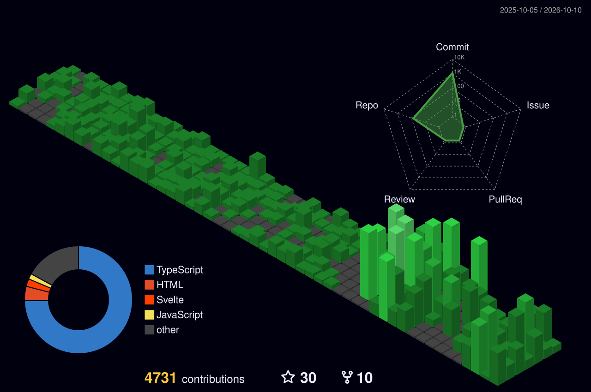

<!-- ================= HEADER BANNER ================= -->
<p align="center">
  
</p>

<h1 align="center">
  
</h1>

<p align="center">
  <a href="https://github.com/m-anwarulkarim">
    
  </a>
  <a href="https://www.linkedin.com/in/anwarul-karim-05235438b/">
    
  </a>
  <a href="mailto:anwarulkarim13@gmail.com">
    
  </a>
</p>

<p align="center">
  
</p>

---

## ⚡ About Me

```yaml
developer: Anwarul Karim
role: Full-Stack Developer (Backend-Focused)
passions: [Scalable Systems, REST APIs, UI/UX Architecture, Open Source]
location: Bangladesh 🇧🇩
learning: [Advanced Microservices, System Design, Cloud Architecture]
```

- 🚀 **Frontend Architecture:** Specialized in building high-performance, responsive UIs with **React, Next.js, TypeScript, & Tailwind CSS**.
- ⚙️ **Backend Systems:** Experienced in designing **REST APIs, Authentication, Databases (PostgreSQL, MongoDB), and ORMs (Prisma)** with **Node.js & Express**.
- 🎯 **Development Philosophy:** Focused on writing clean, maintainable, modular code that scales effortlessly in production.

---

## 🛠️ Tech Stack & Skills

<table align="center" width="100%">
  <tr>
    <td align="center" width="33%">
      <h3>🚀 Frontend</h3>
      
    </td>
    <td align="center" width="33%">
      <h3>⚙️ Backend & DB</h3>
      
    </td>
    <td align="center" width="33%">
      <h3>🔧 Tools & Platforms</h3>
      
    </td>
  </tr>
</table>

---

## 📌 Featured Projects

<table>
  <thead>
    <tr>
      <th>🚀 Project</th>
      <th>📝 Description</th>
      <th>🧰 Tech Stack</th>
      <th>🌐 Live Link</th>
    </tr>
  </thead>
  <tbody>
    <tr>
      <td>🏨 <b>Portfolio</b></td>
      <td>Personal full-stack portfolio showcasing projects, experience, and interactive UI.</td>
      <td><code>React</code> <code>Tailwind CSS</code> <code>Vercel</code></td>
      <td><a href="https://my-protfolio-2.vercel.app/"><b>🔗 Visit Live</b></a></td>
    </tr>
    <tr>
      <td>🛒 <b>E-Commerce UI</b></td>
      <td>Modern, fast, and responsive e-commerce web application with cart management.</td>
      <td><code>React</code> <code>Redux</code> <code>Vite</code></td>
      <td><a href="https://ab-seed.vercel.app/"><b>🔗 Visit Live</b></a></td>
    </tr>
    <tr>
      <td>🎓 <b>Education App</b></td>
      <td>Interactive CRUD-based educational portal with intuitive dashboard.</td>
      <td><code>HTML5</code> <code>JavaScript</code> <code>Bootstrap</code></td>
      <td><a href="https://darul-ihsan.vercel.app/"><b>🔗 Visit Live</b></a></td>
    </tr>
  </tbody>
</table>

---

## 📊 GitHub Analytics

<p align="center">
  
  
</p>

<p align="center">
  
</p>

---

## 🌃 3D Contribution Graph

<p align="center">
  
</p>

---

## 👾 Pacman Contribution Graph

<p align="center">
  
</p>

---

## 🔗 Connect With Me

<p align="center">
  <a href="https://github.com/m-anwarulkarim" target="_blank">
    
  </a>
  <a href="https://www.linkedin.com/in/anwarul-karim-05235438b/" target="_blank">
    
  </a>
  <a href="mailto:anwarulkarim13@gmail.com" target="_blank">
    
  </a>
</p>

---

<p align="center">
  <i>✨ "First make it work. Then make it right. Then make it fast." ✨</i>
</p>

<p align="center">
  
</p>
